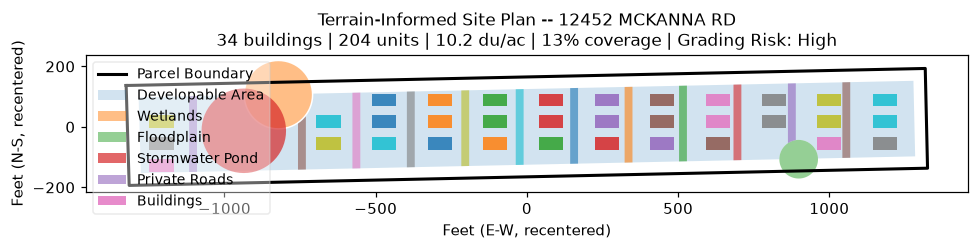

# Kendall County Terrain-Informed Site Planner

A web app that turns any **Kendall County, Illinois** address into a
**terrain-informed, blank-slate site plan**. Enter an address (or click the
map), and the app finds the underlying parcel, pulls its real **USGS 3DEP**
elevation grid, and develops the parcel from scratch — contour-aligned roads and
buildings, a terrain-seeking stormwater pond, slope-based exclusions, and real
cut/fill earthwork economics.

It is the notebook `SitePlan_TerrainInformed_1.ipynb` refactored into a reusable
engine (`siteplan_engine.py`) with a Streamlit front end (`app.py`).



## How it works

1. **Locate the parcel** — the address is matched against the county parcel
   table (an in-memory spatial index), or a map click resolves to the parcel via
   point-in-polygon. Since ~12% of parcels carry no street address, a geocoding
   fallback (OpenStreetMap Nominatim → nearest parcel) covers the rest.
2. **Reproject to feet** — NAD83 / Illinois East (ftUS, EPSG:3435), recentered to
   the origin.
3. **Acquire terrain** — a real USGS 3DEP DEM for the parcel footprint,
   reprojected so every pixel lines up with the parcel. If the live fetch is
   unavailable (offline / no coverage), a synthetic sloped surface is used so the
   pipeline still runs — the UI always tells you which source was used.
4. **Analyze terrain** — best-fit grading plane, local slope grid, a vectorized
   steep-slope exclusion zone, and a low-point sampler for the pond.
5. **Develop from a blank slate** — perimeter setback, wetland/floodplain +
   steep-slope constraints, a terrain-seeking pond at the true low point,
   contour-aligned roads and buildings (falling back to the geometric long axis
   on flat sites), density, and cubic-yard cut/fill cost.

The layout ignores anything currently on the ground — every parcel is treated as
a clean slate.

## Setup

Requires **Python 3.11+** (verified on 3.14, Windows).

```bash
python -m venv .venv
# Windows PowerShell:
.venv\Scripts\Activate.ps1
# macOS/Linux:
# source .venv/bin/activate

pip install -r requirements.txt
```

> **Do not install `aiodns`/`pycares`.** py3dep's async HTTP stack will use
> c-ares for DNS if present, which fails on many Windows machines and silently
> forces the synthetic-terrain fallback. `requirements.txt` intentionally omits
> them.

### Build the parcel index (one time)

The app reads a compact `parcels.parquet`. It's committed to this repo, so you
can skip this step. To rebuild it from the raw county GeoJSON:

```bash
python preprocess.py --src "path/to/il_kendall.json" --dst parcels.parquet
```

## Run

```bash
streamlit run app.py
```

Then open http://localhost:8501, enter an address (e.g. `Fox Rd`,
`309 Danforth Dr`) or click the map, and choose a parcel to develop.

## Configuration

Everything in the sidebar is a live assumption — changing it re-develops the
selected parcel:

| Control | Meaning |
|---|---|
| Target density | Benchmark du/ac the result is measured against |
| Units per building | Program per building footprint |
| Building width / depth | Building footprint |
| Road spacing / width | Internal street grid |
| Perimeter setback | Edge buffer subtracted before layout |
| Max buildable slope | Ground steeper than this is excluded |
| Stormwater pond % | Pond area as a share of net developable area |
| 3DEP resolution | DEM cell size (1 m fine/slow → 10 m coarse/fast) |
| Force synthetic terrain | Offline demo mode |

## Files

| File | Purpose |
|---|---|
| `app.py` | Streamlit UI |
| `siteplan_engine.py` | Parcel lookup + terrain + layout engine (importable) |
| `preprocess.py` | Raw county GeoJSON → `parcels.parquet` (run once) |
| `parcels.parquet` | Compact parcel index used at runtime |
| `SitePlan_TerrainInformed_1.ipynb` | Original research notebook |

## Notes & caveats

- **Wetland/floodplain placeholders** are synthetic (a share of the developable
  area), as in the source notebook — not authoritative FEMA/NWI layers.
- **Earthwork cost** uses simple $/cy cut and fill rates; treat it as an
  order-of-magnitude underwriting screen, not a bid.
- A map click that lands in a road/right-of-way snaps to the nearest parcel.
